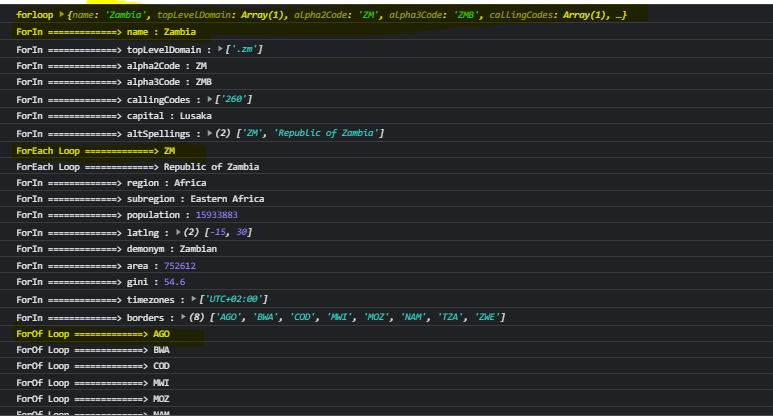

# Day 3 - Assignment

### Task 1: For the given JSON iterate over all for loops (for, for in, for of, forEach)

```

// Set up our HTTP request
// var dataForLoop = null;
var xhr = new XMLHttpRequest();

// Setup our listener to process completed requests
xhr.onload = function () {
  // Process our return data
  if (xhr.status >= 200 && xhr.status < 300) {
    // Runs when the request is successful
    var t = JSON.parse(this.response);
    forLoop(t)
  } else {
    // Runs when it's not
    console.log(xhr.responseText);
  }
};

// Create and send a GET request
// The first argument is the post type (GET, POST, PUT, DELETE, etc.)
// The second argument is the endpoint URL
xhr.open("GET", "https://restcountries.eu/rest/v2/all");
xhr.send();


function forLoop(dataForLoop){
  //  =======================================================
  // Run For Loop to iterate through array of objects
  //  =======================================================
  for(let i=0; i<dataForLoop.length; i++){
    console.log("forloop", dataForLoop[i])
    //  =======================================================
    //  For in Loop
    //  =======================================================
    for (x in dataForLoop[i]) {
      console.log("ForIn =============>", x,":", dataForLoop[i][x])

      if(x === "borders"){
        //  =======================================================
        //  For of Loop
        //  =======================================================
        for (let xVal of dataForLoop[i][x]) {
          console.log("ForOf Loop =============>",xVal)
        }
      }else if(x === "altSpellings"){
         //  =======================================================
          //  ForEach Loop
          //  =======================================================
          dataForLoop[i][x].forEach(function(tObj){
            console.log("ForEach Loop =============>", tObj);
          });
      }
    }
  }
}

```

Output:


<hr>

### Task 2: Create your own resume data in JSON format

```
let resume = {
    "basicDetails": {
        "name": "Eunice Dhivya",
        "email": "diviseed@email.com",
        "address": {
          "postalCode": "600049",
          "city": "Chennai",
          "state": "Tamil Nadu",
          "country": "India"
        },
    },
    "education": [
        {"school": "NAFA", "graduatedin": "2013"},
        {"school": "WCC", "graduatedin": "2008"},
        {"school": "JM Matric", "graduatedin": "2005"}
    ],
    "skills": {
        "graphicdesign": ["photoshop", "illustrator"],
        "webdesign": ["HTML", "CSS", "JavaScript", "D3js"]
    },
    "workExperience": [
        {"designation": "Senior Designer", "company": "The Federal", "years": "2019-Present"},
        {"designation": "Designer", "company": "The Hindu", "years": "2014-2019"},
        {"designation": "Designer", "company": "Rillusion", "years": "2013-2014"}
    ]
};

```

<hr>

### Task 3: Read about the difference between window, screen and document in javascript

Window: its the root of webpage containing the document structure. Its a global variable. eg., A Tab in the Browser

Document: Contains the DOM structure. Its found inside the Window

Screen: Holds information about the browser screen eg., display screen width, height, colorDepth, pixelDepth
