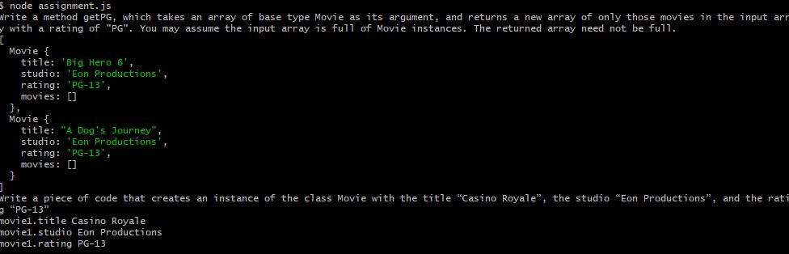

# Day 7 - Assignments

```
// Create class called Movie
// =========================================================

class Movie{

    // a) Write a constructor for the class Movie, which takes a String representing the title of the movie, a String representing the studio, and a String representing the rating as its arguments, and sets the respective class properties to these values.
    // b) The constructor for the class Movie will set the class property rating to "PG" as default when no rating is provided.
    constructor(title, studio, rating="PG­13"){
        this.title = title;
        this.studio = studio;
        this.rating = rating;
        this.movies = [];
    }
    newMovie(element){
        this.movies.push(element);
    }
    getPG(){
        let temp = this.movies.filter(function(obj){
            return obj.rating === "PG­13";
        })
        return temp;
    }
}


// Write a method getPG, which takes an array of base type Movie as its argument, and returns a new array of only those movies in the input array with a rating of "PG". You may assume the input array is full of Movie instances. The returned array need not be full.
let allMovies = new Movie()
allMovies.newMovie(new Movie("Dont Breath", "Eon Productions", "R"));
allMovies.newMovie(new Movie("Big Hero 6", "Eon Productions", "PG­13"));
allMovies.newMovie(new Movie("A Dog's Journey", "Eon Productions", "PG­13"));
allMovies.newMovie(new Movie("Die Hard", "Eon Productions", "R"));

console.log("allMovies.getPG()", allMovies.getPG());

// Write a piece of code that creates an instance of the class Movie with the title “Casino Royale”, the studio “Eon Productions”, and the rating “PG­13”
let movie1 = new Movie("Casino Royale", "Eon Productions", "PG­13");

// call out the properties
console.log("movie1.title", movie1.title);
console.log("movie1.studio", movie1.studio);
console.log("movie1.rating", movie1.rating);

```

Output:


###

```
class Circle{

    constructor(radius=1.0, color = "red"){
        this.radius = radius;
        this.color = color;
    }

    set setRadius(radius){
        this.radius = radius;
    }

    get getRadius() {
        return this.radius;
    }

    set setColor(color){
        return this.color = color;
    }

    get getColor(){
        return this.color;
    }

    toString(){
        return `Circle[radius=${this.radius}, color=${this.color}]`;
    }

    getArea(){
        return Math.PI * (this.radius ** 2);
    }

    getCircumference(){
        return 2 * Math.PI * this.radius;
    }

}

let circle1 = new Circle(10, "blue");
```

### Reference

- https://dev.to/boobo94/uber-cost-algorithm-j2n
- https://www.youtube.com/watch?v=UI6lqHOVHic
