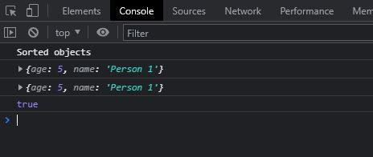
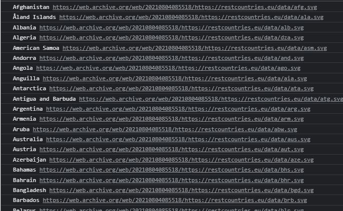
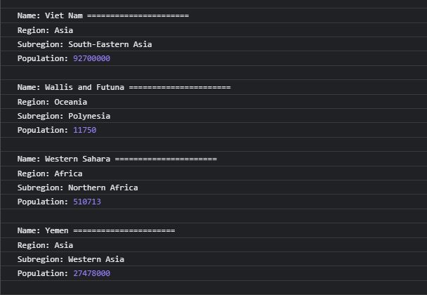

# Day 4 Assignment

## How to compare two JSON have the same properties without order?

```
var obj1 = { name: "Person 1", age:5 };
var obj2 = { age:5, name: "Person 1" };

//sort the order of object
var sorted1 = Object.keys(obj1).sort().reduce(function(obj, key){
        obj[key] = obj1[key];
        return obj;
},{});

//sort the order of object
var sorted2 = Object.keys(obj2).sort().reduce(function(obj, key){
        obj[key] = obj1[key];
        return obj;
},{});


console.log("Sorted objects")
console.log(sorted1)
console.log(sorted2)

// Convert the object to strings and compare
console.log(JSON.stringify(sorted1) === JSON.stringify(sorted2))

```



<hr>

## Import the country data (downloaded copy)

```
let xhr = new XMLHttpRequest();

xhr.onload = function () {

  if (xhr.status >= 200 && xhr.status < 300) {

    let data = JSON.parse(this.response);
    displayCountriesFlags(data)
    displayCountrieRegionsData(data)
  } else {

    console.log(xhr.responseText);
  }
};

```

<hr>

## Use the rest countries API url -> https://restcountries.eu/rest/v2/all and display all the country flags in console

```
// display all the country flags in console
function displayCountriesFlags(data){
    data.forEach(function(country){
        console.log(country.name, country.flag)
    });
}
```



<hr>

## Use the same rest countries and print all countries name, region, sub region and population

```
// display all countries name, region, sub region and population
 in console
function displayCountrieRegionsData(data){
    data.forEach(function(country){
        console.log("")
        console.log("Name:", country.name, "======================")
        console.log("Region:", country.region)
        console.log("Subregion:", country.subregion)
        console.log("Population:", country.population)
    });
}

```



<hr>

[Task List](https://medium.com/@reach2arunprakash/www-guvi-io-zen-d395deec1373)

## Task 1: Simple Programs todo for variables

### 1. Declare four variables without assigning values and print them in console

```
var item1, item2, item3, item4, item5, item6, item7;
console.log("1. Declare four variables without assigning values and print them in console")
console.log(item1);
console.log(item2);
console.log(item3);
console.log(item4);
```

### 2. How to get value of the variable myvar as output

```
var myvar= 1;
console.log("2. How to get value of the variable myvar as output"); //
console.log("myvar"); //remove quotes to fix this line as it turns the var name into string
console.log(myvar);
```

### 3. Declare variables to store your first name, last name, marital status, country and age in multiple lines

var myFirstName = "Divi";
var myLastName = "Seed";
var myMaritalStatus = "Single";
var myCountryName = "India";
var myAge = "30";

### 4. Declare variables to store your first name, last name, marital status, country and age in a single line

```
var myFirstName = "Divi", myLastName = "Seed", myMaritalStatus = "Single", myCountryName = "India", myAge = "30";
```

### 5. Declare variables and assign string, boolean, undefined and null data types

```
var myString = "Divi";
var myBoolean = true;
var myUndefined = undefined;
var myNull = null;
```

// I am 25 years old.
// You are 30 years old.
// 6. Convert the string to integer
// parseInt()
// Number()
// Plus sign(+)

### 7. Write 6 statement which provide truthy & falsey values.

```
console.log(1 === 1); //true because === checks both value and type
console.log(1 === "1"); //false because === checks both value and type
console.log(1 == 1); //true bacause == check only value
console.log("string" === 1) // false because two different data type and values
console.log(true === true) // true because two different data type and values
console.log(true === true) // true because two different data type and values
var objC1 = { name: "Person 1", age:5 };
var objC2 = { age:5, name: "Person 1" };
console.log(JSON.stringify(objC1) === JSON.stringify(objC2)) // false because even if content is same the order of content defers
```

<hr>

## Task 2: Simple Programs todo for variables
