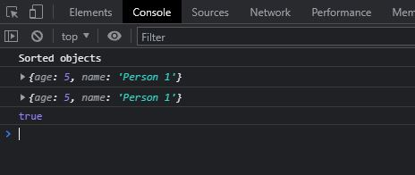
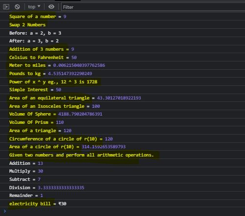
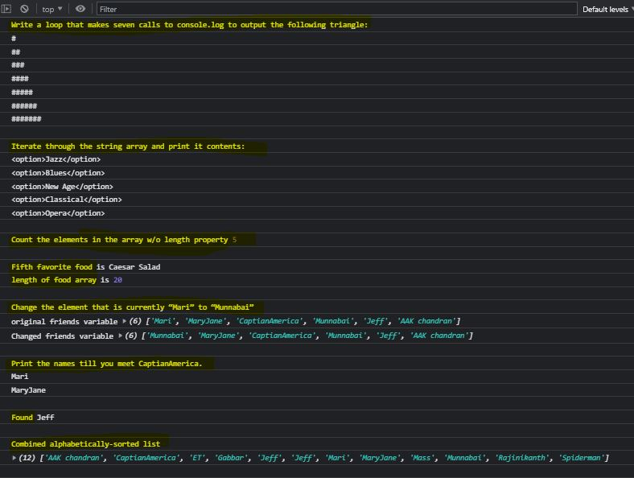
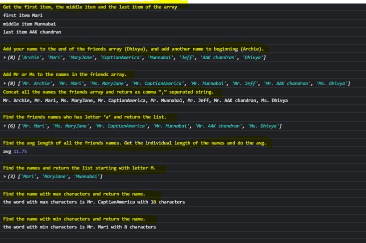

# Day 4 Assignment

## How to compare two JSON have the same properties without order?

```
var obj1 = { name: "Person 1", age:5 };
var obj2 = { age:5, name: "Person 1" };

//sort the order of object
var sorted1 = Object.keys(obj1).sort().reduce(function(obj, key){
        obj[key] = obj1[key];
        return obj;
},{});

//sort the order of object
var sorted2 = Object.keys(obj2).sort().reduce(function(obj, key){
        obj[key] = obj1[key];
        return obj;
},{});


console.log("Sorted objects")
console.log(sorted1)
console.log(sorted2)

// Convert the object to strings and compare
console.log(JSON.stringify(sorted1) === JSON.stringify(sorted2))

```



<hr>

## Import the country data (downloaded copy)

```
let xhr = new XMLHttpRequest();

xhr.onload = function () {

  if (xhr.status >= 200 && xhr.status < 300) {

    let data = JSON.parse(this.response);
    displayCountriesFlags(data)
    displayCountrieRegionsData(data)
  } else {

    console.log(xhr.responseText);
  }
};

```

<hr>

## Use the rest countries API url -> https://restcountries.eu/rest/v2/all and display all the country flags in console

```
// display all the country flags in console
function displayCountriesFlags(data){
    data.forEach(function(country){
        console.log(country.name, country.flag)
    });
}
```


<hr>

## Use the same rest countries and print all countries name, region, sub region and population

```
// display all countries name, region, sub region and population
 in console
function displayCountrieRegionsData(data){
    data.forEach(function(country){
        console.log("")
        console.log("Name:", country.name, "======================")
        console.log("Region:", country.region)
        console.log("Subregion:", country.subregion)
        console.log("Population:", country.population)
    });
}

```


<hr>

[Task List](https://medium.com/@reach2arunprakash/www-guvi-io-zen-d395deec1373)

## Task 1: Simple Programs todo for variables

### 1. Declare four variables without assigning values and print them in console

```
var item1, item2, item3, item4, item5, item6, item7;
console.log("1. Declare four variables without assigning values and print them in console")
console.log(item1);
console.log(item2);
console.log(item3);
console.log(item4);
```

### 2. How to get value of the variable myvar as output

```
var myvar= 1;
console.log("2. How to get value of the variable myvar as output"); //
console.log("myvar"); //remove quotes to fix this line as it turns the var name into string
console.log(myvar);
```

### 3. Declare variables to store your first name, last name, marital status, country and age in multiple lines

var myFirstName = "Divi";
var myLastName = "Seed";
var myMaritalStatus = "Single";
var myCountryName = "India";
var myAge = "30";

### 4. Declare variables to store your first name, last name, marital status, country and age in a single line

```
var myFirstName = "Divi", myLastName = "Seed", myMaritalStatus = "Single", myCountryName = "India", myAge = "30";
```

### 5. Declare variables and assign string, boolean, undefined and null data types

```
var myString = "Divi";
var myBoolean = true;
var myUndefined = undefined;
var myNull = null;
```

// I am 25 years old.
// You are 30 years old.
// 6. Convert the string to integer
// parseInt()
// Number()
// Plus sign(+)

### 7. Write 6 statement which provide truthy & falsey values.

```
console.log(1 === 1); //true because === checks both value and type
console.log(1 === "1"); //false because === checks both value and type
console.log(1 == 1); //true bacause == check only value
console.log("string" === 1) // false because two different data type and values
console.log(true === true) // true because two different data type and values
console.log(true === true) // true because two different data type and values
var objC1 = { name: "Person 1", age:5 };
var objC2 = { age:5, name: "Person 1" };
console.log(JSON.stringify(objC1) === JSON.stringify(objC2)) // false because even if content is same the order of content defers
```

<hr>

## Task 2: Simple Programs todo for Operators

### Square of a number = 3 using \*\* operator

```
console.log("Square of a number =", 3 ** 2)
```

### Swapping 2 numbers

```
let NumA = 2;
let NumB = 3;
console.log(`Swap 2 Numbers`)
console.log(`Before: a = ${NumA}, b = ${NumB}`)

// store Num A temporarily
let tempNum = NumA;

// Assign NumB val to Num A
NumA = NumB;

// Assign the tempNum that contains NumA data to NumB
NumB = tempNum;
console.log(`After: a = ${NumA}, b = ${NumB}`)
```

### Addition of 3 numbers

```
console.log("Addition of 3 numbers =", 3 + 3 + 3);
```

### Celsius to Fahrenheit conversion 10 to 50

```
let cel = 10;
let cel2Fah = cel \* 9/5 + 32 ;
console.log("Celsius to Fahrenheit =", cel2Fah);
```

### Meter to miles meter / 1609

```
let met = 10;
let met2miles = met / 1609 ;
console.log("Meter to miles =", met2miles);
```

### Pounds to kg pound / 2.205

```
let pd = 10;
let pd2kg = pd / 2.205 ;
console.log("Pounds to kg =", pd2kg);
```

### Power of any number x ^ y.

```
let x = 12, y = 3;
console.log(`Power of x ^ y eg., ${x} ^ ${y} is ${x ** y}`);
```

### Calculate Simple Interest (p _ r _ t)/100

```
let p = 1000, r = 5, t= 1; // Principal value, Rate of Interest, Time (year)
let si = (p * r * t)/100;
console.log("Simple Interest =", si);
```

### Calculate area of an equilateral triangle

```
let es = 10; // side of triangle
let areaEqTriangle = Math.sqrt(3)/4*(es**2);
console.log("Area of an equilateral triangle =", areaEqTriangle);
```

### Area Of Isosceles Triangle

```
let ib = 10, ih = 20; // base of triangle, height of triangle
let areaIsTriangle = (ib * ih) / 2;
console.log("Area of an Isosceles triangle =", areaIsTriangle);
```

### Volume Of Sphere

```
let sR = 10;
let volSphere = (4 / 3) * Math.PI * (sR * 3);
console.log("Volume Of Sphere =", volSphere);
```

### Volume Of Prism

```
let pBA = 10, pL = 11; // base Area of prism, length of prism
let volPrism = pBA * pL;
console.log("Volume Of Prism =", volPrism);
```

### Find area of a triangle.

```
let tB = 20, tH = 12; // base of triangle, height of triangle
let areaTriangle = (tB * tH) / 2;
console.log("Area of a triangle =", areaTriangle);
```

### Given their radius of a circle and find its diameter, circumference and area.

```
let cR = 10;
let cD = 10 * 2;
let circumference = 2 * Math.PI * cR;
let areaCircle = Math.PI * (cR ** 2);

console.log("Circumference of a circle of r(10) =", areaTriangle);
console.log("Area of a circle of r(10) =", areaCircle);
```

### Given two numbers and perform all arithmetic operations.

```
let numOne = 10, numTwo = 3;
console.log("Given two numbers and perform all arithmetic operations.");
console.log("Addition =", numOne + numTwo);
console.log("Multiply =", numOne * numTwo);
console.log("Subtract =", numOne - numTwo);
console.log("Division =", numOne / numTwo);
console.log("Remainder =", numOne % numTwo);
```

### Calculate electricity bill?

For example, a consumer consumes 100 watts per hour daily for one month. Calculate the total energy bill of that consumer if per unit rate is 10?

```
let kW = 0.1, time = 1, costPerUnit = 10;
let energyPerDay = kW _ 1;
let energyPerMonth = energyPerDay _ 30;
let energyCostMonth = energyPerMonth \* costPerUnit;
console.log(`electricity bill = ₹${energyCostMonth}`);
let mathGrade = 8
```

### Output:



## Task 3: Simple Programs todo for Condition , Looping and Arrays

### 1. Write a loop that makes seven calls to console.log to output the following triangle:

expected output

```
// #
// ##
// ###
// ####
// #####
// ######
// #######
```

```
console.log("Write a loop that makes seven calls to console.log to output the following triangle:");
let myHash = "#"
for(let i=1; i<= 7; i++){
  // use repeat method
  console.log(myHash.repeat(i))
}
```

### 2. Iterate through the string array and print it contents

```
console.log("Iterate through the string array and print it contents:");
var strArray= ["<option>Jazz</option>",
      ,"<option>Blues</option>",
      ,"<option>New Age</option>",
      ,"<option>Classical</option>",
      ,"<option>Opera</option>"]

strArray.forEach(function(str){
  console.log(str)
});
```

### 3. Write a code to count the elements in the array . Don’t use length property

```
var myarray=[11,22,33,44,55]
let myArrLen = 0;
while(myarray[myArrLen] !== undefined){
  myArrLen++;
}

console.log("Count the elements in the array w/o length property", myArrLen)
```

### 4. Create an array called foods holds the names of your top 20 favorite foods, starting with the best food.

let foods=["Pizza", "Fried Rice", "Hamburger", "Soup", "Caesar Salad", "Hash Browns", "Baked Potato", "Fried Chicken", "Grilled Cheese", "French Fries", "Mashed Potatoes", "Cheese Cake", "Chocolate Truffle Cakes", "Waffles", "Ice Cream", "Lemon Sorbet", "Muffins", "Croissant", "Egg puff", "Chicken puff" ]

- How can you find your fifth favorite food?

```
// use square notation and number 5-1 because index starts at 0
console.log("Fifth favorite food", foods[4]);
```

- Find the length of your foods array

```
console.log("length of food array is", foods.length);
```

### 5. Starting from the existing friends variable below, change the element that is currently “Mari” to “Munnabai”.

```
console.log("Change the element that is currently “Mari” to “Munnabai”")
let friends = [ "Mari", "MaryJane", "CaptianAmerica", "Munnabai", "Jeff", "AAK chandran"];
console.log("original friends variable", friends);
function changeItemName(input){
  for (var i = 0; i < input.length; i++) {
    if(input[i] === "Mari"){
      input[i] = "Munnabai"
    }
  }
}
changeItemName(friends);

console.log("Changed friends variable", friends);
console.log("");
```

### 6. Starting from the friends variable below, Loop and Print the names till you meet CaptianAmerica.

```
let friends2 = [ "Mari", "MaryJane", "CaptianAmerica", "Munnabai", "Jeff", "AAK chandran"];
function meetCaptian(input){
  for (var i = 0; i < input.length; i++) {
    if(input[i] !== "CaptianAmerica"){
      console.log(input[i]);
    }else{
      break;
    }

  }
}

console.log("Print the names till you meet CaptianAmerica.");
meetCaptian(friends2);
```

### Find the person is ur friend or not.

```
let friends3 = [ "Mari", "MaryJane", "CaptianAmerica", "Munnabai", "Jeff", "AAK chandran"];
function findFriend(input, name){
  for (var i = 0; i < input.length; i++) {
      if(input[i] === name){
        return input[i];
      }
  }
}
let found = findFriend(friends3,"Jeff");
console.log("Found", found);
```

### We have two lists of friends below. Use array methods to combine them into one alphabetically-sorted list.

```

var friendsOne = ["Mari", "MaryJane", "CaptianAmerica", "Munnabai", "Jeff", "AAK chandran"];
var friendsTwo = [ "Gabbar","Rajinikanth","Mass","Spiderman","Jeff","ET"];
function dataHandling(input1, input2){
//Your code goes here
  let temp2 = input1.concat(input2)
  return temp2.sort();
}
let sortedandCombined = dataHandling(friendsOne, friendsTwo);

console.log("Combined alphabetically-sorted list")
console.log(sortedandCombined)

```

### output



<hr>

### Get the first item, the middle item and the last item of the array

```
console.log("Get the first item, the middle item and the last item of the array");
let friends = ["Mari", "MaryJane", "CaptianAmerica", "Munnabai", "Jeff", "AAK chandran"];
console.log("first item", friends[0]);
console.log("middle item", friends[friends.length/2]);
console.log("last item", friends[friends.length-1]);
console.log("");
```

### Add your name to the end of the friends array, and add another name to beginning.

```
console.log("Add your name to the end of the friends array (Dhivya), and add another name to beginning (Archie).");
friends.push("Dhivya")
friends.unshift("Archie")
console.log(friends);
console.log("");
```

### Add Mr or Ms to the names in the friends array.

```

console.log("Add Mr or Ms to the names in the friends array.");
for(let i=0; i<friends.length; i++){
  if(friends[i] === "MaryJane" || friends[i] === "Dhivya"){
    friends[i] = "Ms. "+friends[i]
  }else{
    friends[i] = "Mr. "+friends[i]
  }
}

console.log(friends);
```

### Concat all the names the friends array and return as comma “,” seperated string.

```
console.log("Concat all the names the friends array and return as comma “,” seperated string.");
let strComma = "";
for(let i=0; i<friends.length; i++){
  if(i !== friends.length-1){
    strComma += friends[i] + ", "
  }else{
    strComma += friends[i]
  }

}
console.log(strComma);
console.log("");
```

### Find the friends names who has letter ‘a’ and return the list.

```
console.log("Find the friends names who has letter ‘a’ and return the list.");
function returnA(input){
  let strWA = [];
  for(let i=0; i<input.length; i++){
    if(input[i].includes("a")){
      strWA.push(input[i])
    }
  }
  return strWA;
}
```

### Find the friends names who has letter ‘a’ and return the list.

```
console.log("Find the friends names who has letter ‘a’ and return the list.");
function returnA(input){
  let strWA = [];
  for(let i=0; i<input.length; i++){
    if(input[i].includes("a")){
      strWA.push(input[i])
    }
  }
  return strWA;
}
let storeStrWA = returnA(friends);
console.log(storeStrWA);
```

### Find the avg length of all the friends names. Get the individual length of the names and do the avg.

```
console.log("Find the friends names who has letter ‘a’ and return the list.");

let getSumofNames = 0;
for(let i=0; i<friends.length; i++){
  getSumofNames += friends[i].length;
}

console.log("avg", getSumofNames/friends.length);
```

### Find the names and return the list starting with letter M.

```
console.log("Find the names and return the list starting with letter M.");
let friends2Filter = ["Mari", "MaryJane", "CaptianAmerica", "Munnabai", "Jeff", "AAK chandran"];

let namesStartingWM = friends2Filter.filter(function(obj){
  return obj.startsWith("M");
})

console.log(namesStartingWM);
```

### Find the name with max characters and return the name.

```
console.log("Find the name with max characters and return the name.");
let maxLengthCounter = 0;
let maxWord;
for (let i = 0; i < friends.length; i++) {
  if (friends[i].length > maxLengthCounter) {
    maxLengthCounter = friends[i].length;
    maxWord = friends[i];
  }
}
console.log(`the word with max characters is ${maxWord} with ${maxLengthCounter} characters`);
```

### Find the name with min characters and return the name.

```
console.log("Find the name with min characters and return the name.");
let minLengthCounter = friends[0].length;
let minWord;
for (let i = 0; i < friends.length; i++) {

  if(friends[i].length < minLengthCounter){
    minLengthCounter = friends[i].length;
    minWord = friends[i];
    // console.log(minWord, minLengthCounter);
  }
}
console.log(`the word with min characters is ${minWord} with ${minLengthCounter} characters`);
```


