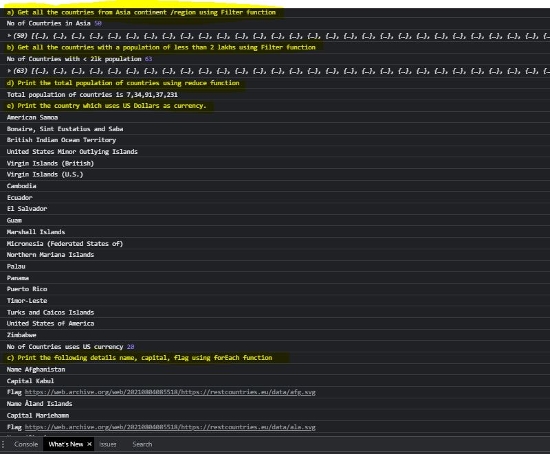

# Day 8 - Assignment

```

let xhr = new XMLHttpRequest();

xhr.onload = function () {

  if (xhr.status >= 200 && xhr.status < 300) {

    let data = JSON.parse(this.response);
    displayCountries(data)
    // displayCountrieRegionsData(data)
  } else {

    console.log(xhr.responseText);
  }
};

// Create and send a GET request
xhr.open("GET", "country-api.json");
xhr.send();

// =====================================================================================================
// Use the rest countries API url -> https://restcountries.eu/rest/v2/all and display all the country data
// =====================================================================================================
function displayCountries(dataForLoop){
//   console.log("No of Countries", dataForLoop);

  console.log("a) Get all the countries from Asia continent /region using Filter function");
  let getAsianRegion = dataForLoop.filter(function(obj){
      return obj.region === "Asia";
  })
  console.log("No of Countries in Asia", getAsianRegion.length);
  console.log(getAsianRegion);

  console.log("b) Get all the countries with a population of less than 2 lakhs using Filter function");
  let getCountriesLess2LK = dataForLoop.filter(function(obj){
    return obj.population < 200000;
  })
  console.log("No of Countries with < 2lk population", getCountriesLess2LK.length);
  console.log(getCountriesLess2LK)

  console.log("d) Print the total population of countries using reduce function");
  let totalPopulation = dataForLoop.map(function(obj){ //use map to isolate population data
        return obj.population;
  }).reduce(function(prev, next){  //sum all the values down to single population
    return prev + next;
  })
  console.log(`Total population of countries is ${totalPopulation.toLocaleString('en-IN')}`);

  console.log("e) Print the country which uses US Dollars as currency.");
    // let getCountriesUSCurr = dataForLoop.filter(function(obj2){ //use map to isolate population data
      let countriesWUSCurr = []
      dataForLoop.forEach(function(obj){
             if(obj.currencies.filter(e => e.code === 'USD') != 0){
                    countriesWUSCurr.push(obj);
                    console.log(obj.name);
             }
      })

    console.log("No of Countries uses US currency", countriesWUSCurr.length);


  console.log("c) Print the following details name, capital, flag using forEach function");
  dataForLoop.forEach(function(obj){
    console.log("Name", obj.name);
    console.log("Capital", obj.capital);
    console.log("Flag", obj.flag);
  })


}


```

Note: The Rest Country API Had loading issues so using a downloaded copy


