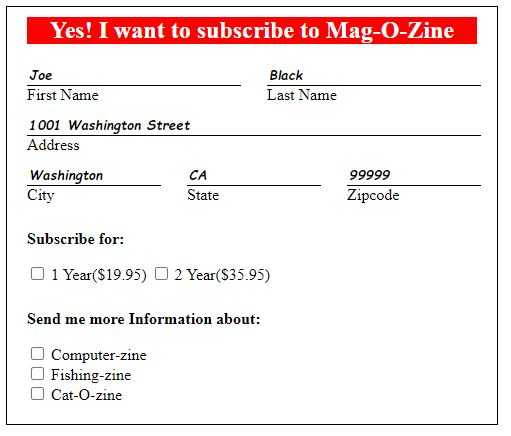
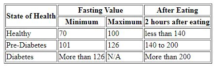
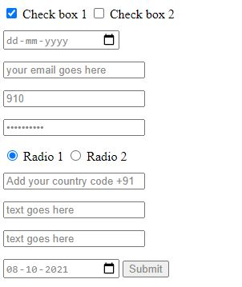

# [Guvi Zen](https://www.guvi.io/zen/)

## HTML Task to know usage of basic tags.

### 1. Fix the bugs in below snippet

```HTML
    <html lang="en">
    <head>
        <title>Document
            <body>
                guvi
        </title>
    </head>
    <div>
        Lorem ipsum dolor sit amet consectetur adipisicing elit.
        <div>
            <div>
                Guvi Geek Network
            </div>
        </body>
    </html>
```

**_ Fixed Code _**

```
<html lang="en">
    <head>
        <title> guvi </title>
    </head>
    <body>
      <div>
        Lorem ipsum dolor sit amet consectetur adipisicing elit.
      </div>
      <div>
          Guvi Geek Network
      </div>
    </body>
</html>
```

### 2. Try the below one

```HTML
<html lang="en">
    <head>
        <title>Document
            <body>
                guvi
    </head>
    <div>
        Lorem ipsum dolor sit amet consectetur adipisicing elit.
        <div>
            <div>
                Guvi Geek Network
            </div>
        </body>
    </html>
```

**_ Fixed Code _**

```
<html lang="en">
    <head>
        <title> guvi </title>
    </head>
    <body>
      <div>
        Lorem ipsum dolor sit amet consectetur adipisicing elit.
      </div>
      <div>
          Guvi Geek Network
      </div>
    </body>
</html>
```

---

### 3. Design a contact us form with all fields as required.

```
<form>

  <label for="fname">First Name</label>
  <input type="text" /> <br>
  <label for="lname">Email</label>
  <input type="text" />  <br>
  <label for="subject">Message</label>  <br>
  <textarea id="subject" name="subject" placeholder="Write something.." style="height:200px"></textarea>
  <input type="submit" value="Submit">

</form>
```

---

4. Use certain HTML elements to display the following in a HTML page.

- Programming Language
  - JavaScript
    1. Angular
    2. React
    3. Vue.js
  - Python
    1. Django Framework
    2. Flask Framework
  - Java
    1. Spring
    2. Maven
    3. Hibernate
- Database
  - MySQL
  - MongoDB
  - Cansandra

```
<ul>
    <li>Programming Language
        <ul>
            <li>JavaScript
                <ol>
                    <li>Angular</li>
                    <li>React</li>
                    <li>Vue.js</li>
                </ol>
            </li>
            <li>Python
                <ol>
                    <li>Django Framework</li>
                    <li>Flask Framework</li>
                </ol>
            </li>
            <li>Java
                <ol>
                    <li>Spring</li>
                    <li>Maven</li>
                    <li>Hibernate</li>
                </ol>
            </li>
        </ul>
    </li>
    <li>Database
        <ul>
            <li>MySQL</li>
            <li>MongoDB</li>
            <li>Cansandra</li>
        </ul>
    </li>
</ul>
```

---

### 5. Create an element that helps you to open the https://google.com in separate new tab.

```
<a href="https://google.com/" target="_blank">Click Me</a>
```

---

### 6. In the form, add two radio buttons with grouping them for employee type(Salaried and own business)

```
<form>

        <label for="fname">First Name</label>
        <input type="text" /> <br>
        <label for="lname">Email</label>
        <input type="text" />  <br>
        <label for="subject">Message</label>  <br>
        <textarea id="subject" name="subject" placeholder="Write something.." style="height:200px"></textarea>

        <fieldset>
            <legend>Employee type</legend>
            <input type="radio" id="salaried" name="salaried" value="salaried">
            <label for="salaried">Salaried</label><br>
            <input type="radio" id="Own-Business" name="Own-Business" value="Own Business">
            <label for="Own-Business">Own business</label><br>

        </fieldset>
        <br>

        <input type="submit" value="Submit">

      </form>
```

---

### 7. Design form shown in the link (http://evc-cit.info/cit040/formguide/card_0.png)

```
<style>
        #magazine-subscription-form {
            border: 1px solid black;
            width: 450px;
            padding: 10px 20px;
        }
        #magazine-subscription-form h2{
            margin: 0 0 20px 0;
            text-align: center;
        }
        #magazine-subscription-form .row {
            margin: 0 0 10px 0;
            display: flex;
            column-gap: 30px;
        }
        #subscribe {
            /* display: flex; */
        }
        #subscribe label, #subscribe input, .mag{
            display: inline-block;
            width: fit-content !important;
        }
        #magazine-subscription-form .col, #magazine-subscription-form .col input {
            width: 100%;
        }
        #magazine-subscription-form .col input {
            border:none;
            border-bottom: 1px solid black;
            font-family: cursive;
            font-style: italic;
            font-weight: bold;
        }
        .form-head{
            background-color: red;
            color: white;
        }

    </style>
    <form id="magazine-subscription-form">
        <h2 class="form-head">Yes! I want to subscribe to <span>Mag-O-Zine</span></h2>
        <div class="row">
            <div class="col">
                <input type="text" name="fname" id="fname" value="Joe" /> <br>
                <label for="fname">First Name</label>
            </div>
            <div class="col">
                <input type="text" name="lname" id="lname" value="Black"  /> <br>
                <label for="lname">Last Name</label>
            </div>
        </div>
        <div class="row">
            <div class="col">
                <input type="text" name="address" id="address"  value="1001 Washington Street" /> <br>
                <label for="address">Address</label>
            </div>
        </div>
        <div class="row">
            <div class="col">
                <input type="text" name="city" id="city"  value="Washington" /> <br>
                <label for="city">City</label>
            </div>
            <div class="col">
                <input type="text" name="state" id="state" value="CA" /> <br>
                <label for="state">State</label>
            </div>
            <div class="col">
                <input type="text" name="zipcode" id="zipcode" value="99999" /> <br>
                <label for="zipcode">Zipcode</label>
            </div>
        </div>
        <div class="row">
            <div class="col" id="subscribe">

                <p style="font-weight:bold;">Subscribe for:</p>
                <input type="checkbox" id="sub1" name="sub1">
                <label for="vehicle1"> 1 Year($19.95)</label>

                <input type="checkbox" id="sub2" name="sub2">
                <label>2 Year($35.95) </label>

            </div>
        </div>
        <div class="row">
            <div class="col">

                <p style="font-weight:bold;"> Send me more Information about: </p>
                <input type="checkbox" class="mag" id="mag1" name="mag1"><label for="mag1"> Computer-zine</label> <br>
                <input class="mag" type="checkbox" id="mag2" name="mag2" value="Car"><label for="mag2"> Fishing-zine</label> <br>
                <input  class="mag"  type="checkbox" id="mag3" name="mag3" value="Boat"><label for="vehicle1"> Cat-O-zine</label>
            </div>
        </div>
```

** Output **


---

8. Use the table tag to design given image [Click here](https://www.bapugraphics.com/assets/img/port_upload_dir/table-4.jpg).

```
<table>
  <thead>
    <tr>
      <th rowspan="2">State of Health</th>
      <th colspan="2">Fasting Value</th>
      <th>After Eating</th>
    </tr>
    <tr>
      <th>Minimum</th>
      <th>Maximum</th>
      <th>2 hours after eating</th>
    </tr>
  </thead>
  <tbody>
    <tr>
      <td>Healthy</td>
      <td>70</td>
      <td>100</td>
      <td>less than 140</td>
    </tr>
    <tr>
      <td>Pre-Diabetes</td>
      <td>101</td>
      <td>126</td>
      <td>140 to 200</td>
    </tr>
    <tr>
      <td>Diabetes</td>
      <td>More than 126</td>
      <td>N/A</td>
      <td>More than 200</td>
    </tr>
  </tbody>
</table>
```

** Output **


---

9. Write HTML input tags snippet to show default values for all Form elements.

```
<style>
            input {
                color:#888888;
                margin-bottom: 15px;
            }
        </style>
        <input type="checkbox" checked="checked"> Check box 1 <input type="checkbox"> Check box 2<br>
        <input type="date"> <br>
        <input type="email" value="your email goes here"> <br>
        <input type="number" value="910"> <br>
        <input type="password" value="**********"> <br>
        <input type="radio" checked="checked"> Radio 1 <input type="radio"> Radio 2 <br>
        <input type="tel" value="Add your country code +91"> <br>
        <input type="text" value="text goes here"> <br>
        <input type="textarea" value="text goes here"> <br>
        <input type="date" value="2021-10-08">
        <input type="submit" value="Submit">
```

** Output **


---

10. In your, HTML page add the below line and Highlight it without using any CSS.

- "HTML & CSS is awesome"

```
<p bgcolor="red">HTML & CSS is awesome</p>
```

---

11. Create an HTML page, which should contain all types of input elements.
